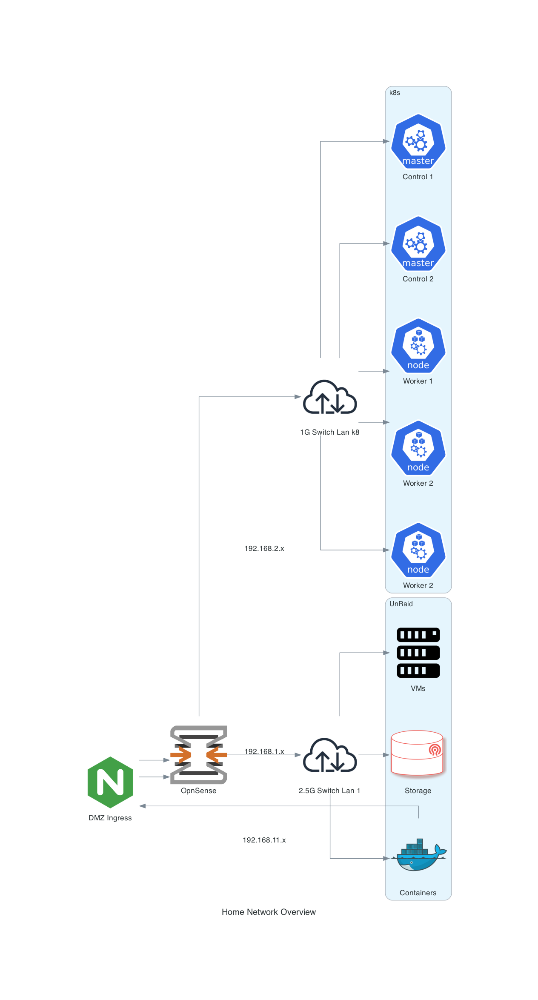

# Home lab

* This contains IaC for my k8 home clusters
* It was templeted using https://github.com/fluxcd/flux2-kustomize-helm-example


## Tools and Technologies

* Talos Linux
* Fluxcd
* Helm
* Kustomize
* [Task](https://taskfile.dev/usage)
* [Sops](https://github.com/getsops/sops)

## Talos Linux

Dashboard

```
task talos:dash"
```

Scale up cluster

```
talosctl apply-config --insecure \
    --nodes [NODE IP] \
    --file controlplane.yaml | worker.yaml
```

### Flux

Build apps manifest

```
flux build kustomization apps --path apps/local/ 
```

Build infra local manifest

```
flux build kustomization infra-controllers-local --path infrastructure/local
```

Build without connecting to cluster

```
flux build kustomization infra-dependencies --path infrastructure/dependencies \
--kustomization-file infrastructure/dependencies/kustomization.yaml \
--dry-run
```

Sync git repo 

```
flux reconcile source git flux-system  
```


## Bootstrap staging and production

```sh
export GITHUB_TOKEN=<your-token>
export GITHUB_USER=umizoom
export GITHUB_REPO=https://github.com/umizoom/homek8s
```

```sh
flux bootstrap github \
    --context=kind-kind \
    --owner=${GITHUB_USER} \
    --repository=${GITHUB_REPO} \
    --branch=refactor \
    --personal \
    --path=clusters/local
```

```sh
flux bootstrap github \
    --owner=${GITHUB_USER} \
    --repository=${GITHUB_REPO} \
    --branch=main \
    --personal \
    --path=clusters/production
```

### Secrets 

https://fluxcd.io/flux/guides/mozilla-sops/


Encrypting secrets

```sh
task sops:encrypt
```

bootstrapping
```sh
flux create kustomization my-secrets \
--source=flux-system \
--path=./clusters/production \
--prune=true \
--interval=10m \
--decryption-provider=sops \
--decryption-secret=sops-gpg
```

## Diagram

