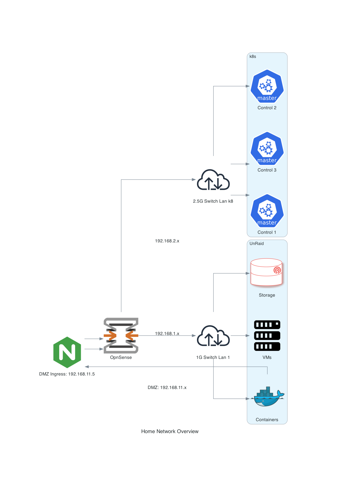

# Home Lab

This repository contains Infrastructure as Code for Kubernetes home clusters, templated from the [Flux2 Kustomize Helm Example](https://github.com/fluxcd/flux2-kustomize-helm-example).


## Tools and Technologies

* Talos Linux
* Fluxcd
* Helm
* Kustomize
* [Task](https://taskfile.dev/usage)
* [Sops](https://github.com/getsops/sops)
* [Pre-Commit](https://pre-commit.com/index.html)

## Install Pre-Commit

```bash
pre-commit install
```

## Talos Linux

### Dashboard

```bash
task talos:dash
# OR
tadash1
```

### Scale Up Cluster

```bash
talosctl apply-config --insecure \
    --nodes [NODE IP] \
    --file controlplane.yaml | worker.yaml
```

### Upgrade Talos OS

1. Update talos version in `hacking/ansible/talos-upgrade.yaml`
2. Run `task talos:upgrade`
3. Manually update worker and control files with new version: `sops --d --in-place talos/worker.yaml`
4. Commit and push changes

### Generate Secrets

Generate `secrets.yaml` from control plane configuration:

```bash
talosctl gen secrets --from-controlplane-config controlplane-1.yaml
```

### Get Disk Information

```bash
talosctl get disks --nodes 192.168.2.2
```

### Kubernetes

Upgrade Kubernetes version:

Note: At times you need to run `brew install siderolabs/tap/talosctl` to upgrade talosctl CLI.

1. Test a dry run upgrade via: `talosctl --nodes 192.168.2.2 upgrade-k8s --to v1.35.0 --dry-run`
2. Run the actual upgrade: `talosctl --nodes 192.168.2.2 upgrade-k8s --to v1.35.0`
3. Update talos worker and control files via: `./hacking/k8-upgrade/update-sourcefiles.sh v1.35.0`
4. Commit and push changes


### Flux

Build apps manifest:

```bash
flux build kustomization apps --path apps/local/
```

Build infra local manifest:

```bash
flux build kustomization infra-controllers-local --path infrastructure/local
```

Build without connecting to cluster:

```bash
flux build kustomization infra-dependencies --path infrastructure/dependencies \
--kustomization-file infrastructure/dependencies/kustomization.yaml \
--dry-run
```

Sync git repo:

```bash
flux reconcile source git flux-system
```


## Bootstrap Staging and Production

Set up environment variables:

```sh
export GITHUB_TOKEN=<your-token>
export GITHUB_USER=umizoom
export GITHUB_REPO=https://github.com/umizoom/homek8s
```

Bootstrap staging cluster:

```sh
flux bootstrap github \
    --context=kind-kind \
    --owner=${GITHUB_USER} \
    --repository=${GITHUB_REPO} \
    --branch=refactor \
    --personal \
    --path=clusters/local
```

Bootstrap production cluster:

```sh
flux bootstrap github \
    --owner=${GITHUB_USER} \
    --repository=${GITHUB_REPO} \
    --branch=main \
    --personal \
    --path=clusters/production
```

### Secrets

For detailed information, see the [Flux SOPS guide](https://fluxcd.io/flux/guides/mozilla-sops/).

Encrypting secrets:

```sh
task sops:encrypt
```

Bootstrapping:

```sh
flux create kustomization my-secrets \
--source=flux-system \
--path=./clusters/production \
--prune=true \
--interval=10m \
--decryption-provider=sops \
--decryption-secret=sops-gpg
```

## Diagram


